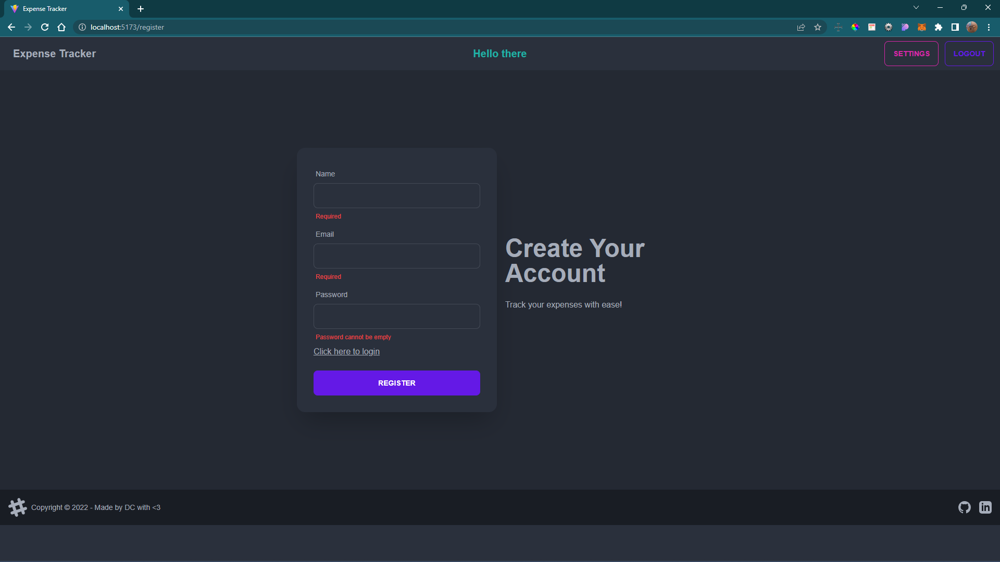
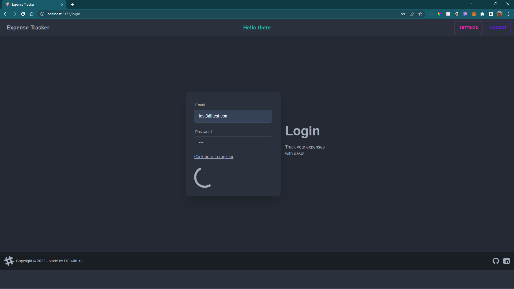
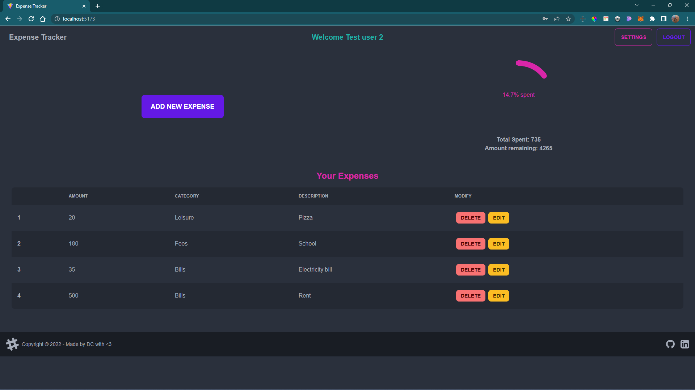
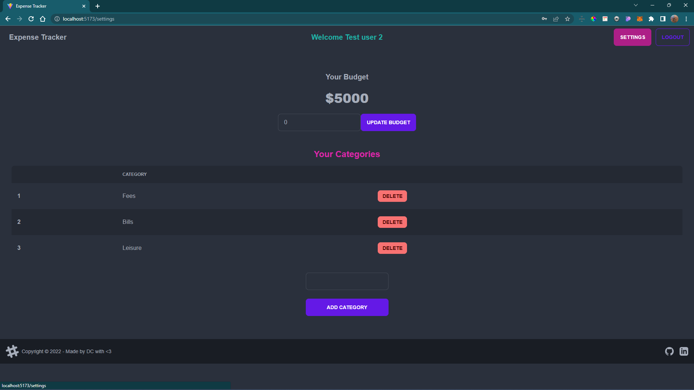
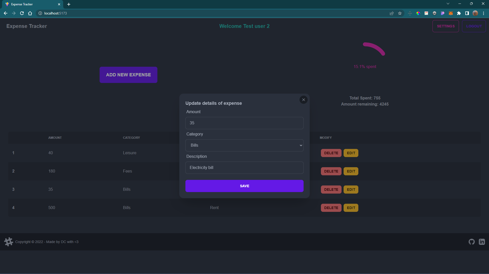

# mern-expense-tracker-client

### Description

Does just as it says. Track your daily expenses with ease using this expense tracker app. This repository contains frontend code for the mern-expense-tracker app. You can checkout the backend code in [this repo](https://github.com/01-DC/mern-expense-tracker-server)

### How to use?

-   Clone this repo.
-   `cd` into the repo folder and type `npm i` to install all dependencies.
-   Then type `npm run dev` to start the server.

### Features

-   Login and Signup feature with anti forced browsing safety.
-   Complete CRUD support on expenses.
-   Add expenses in any category with description.
-   Update your budget any time.
-   Add or Delete your own category tags.
-   Summary chart on home screen to get overview of expenditure.
-   Separate settings page to manage your budget and category labels.
-   Custom made Toast system to display error and success messages.
-   Full responsive site.

### Libraries Used

-   `react` : As the frontend javascript library to build the frontend on.
-   `react-router-dom` : Used react router to navigate between pages and design complete signup to login to home page flow.
-   `daisyui` : Used DaisyUI to design the pages using pre-built components. DaisyUI is based on TailwindCSS at its core.
-   `formik` : Used Formik to quickly design fast and robust forms with features like in-built state control and validation.
-   `axios` : Used Axios library to make API calls to backend simpler and fast.
-   `vite` : Used Vite as the build tool. Much faster and developer friendly.

### Screenshots

